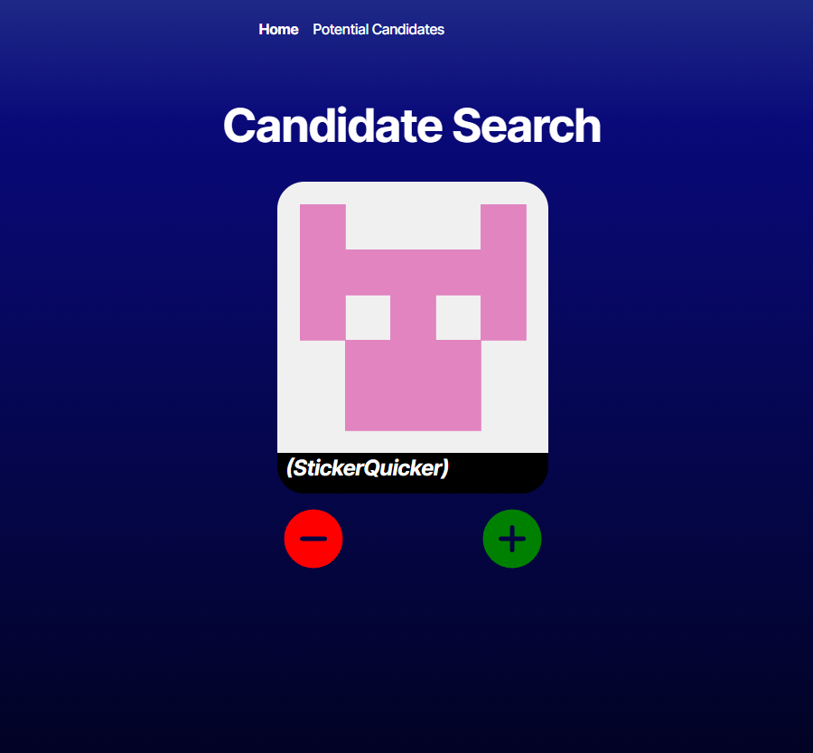
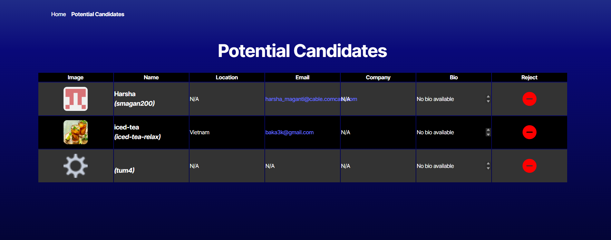

# Git-Candidate-Search


## Table of Contents
- [Description](#description)
- [Installation](#installation)
- [Technologies](#technologies)
- [License](#license)
- [Links](#links)
- [Questions](#questions)

## Description 
An application that calls GitHub API to populate data to the user. This returns profiles of random Git Users, along with public data populated (by them) to their account. Makes use of localStroage to save candidates to a secondary screen for further screening. Applicants at the second stage can be removed from that point as well. 




## Installation
If you decide to run the application locally, execute the following commands at the root:

```bash
npm i
npm run dev
```

## Technologies

* JavaScript
* TypeScript
* Node.js
* React

## License
This project is licensed under the MIT License. 

## Links
- [GitHub Repo](https://github.com/Bakenavva/Git-Candidate-Search)
- [Deployed Application](https://git-candidate-search-18kv.onrender.com)

## Questions
Further questions can reach me via:
- GitHub: [Bakenavva](https://github.com/Bakenavva)
- Email:  ernestoaleman00@gmail.com
